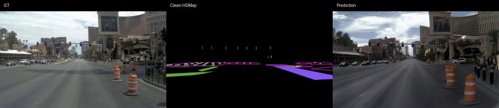
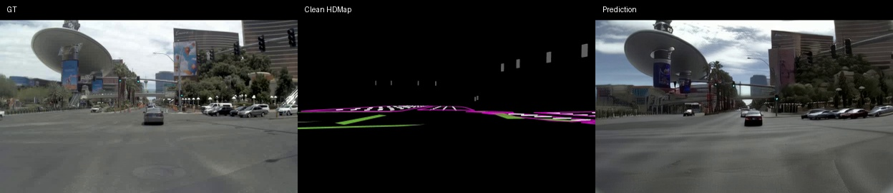
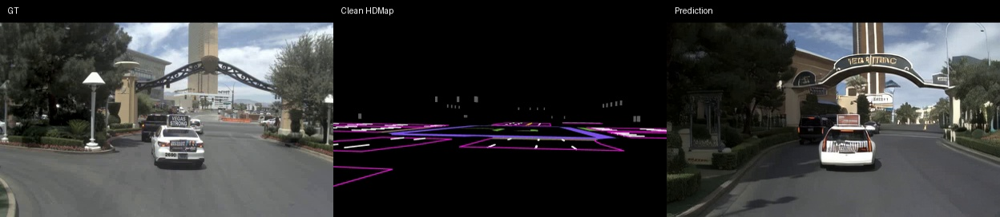
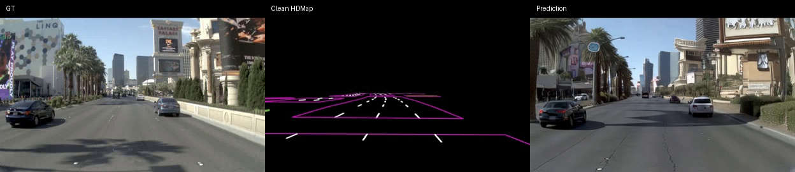
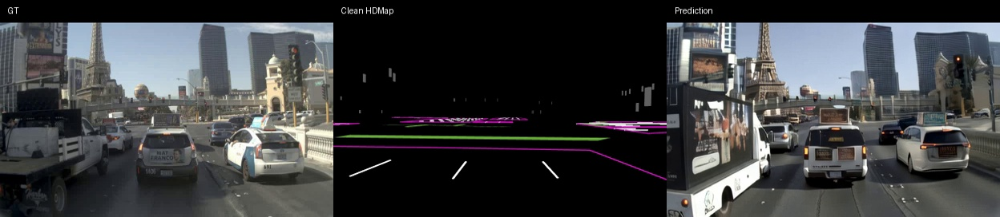
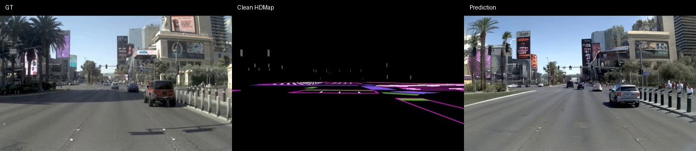
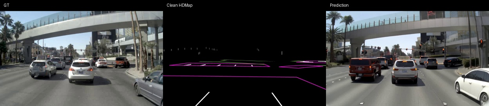
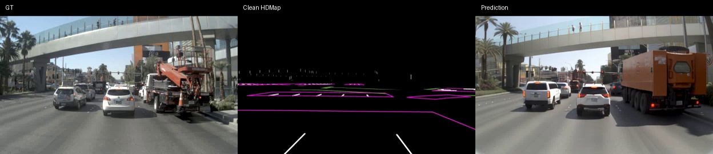
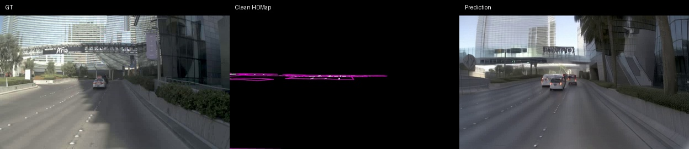

# Box3D · 13000 步快速验证

**240p（单视图 416×240） · 25 帧 · 10 条验证样本**

累计训练 13000 步：原模型 12000 步，显式方向分支适配 1000 步。

对比视频从左到右为 **GT（真实视频） / Clean HDMap / Prediction（生成结果）**。

网页默认显示输入3D框在GT与Prediction上的同位置投影，可取消“3D框”切回原视频。红色为车头面，青色为车尾面，黄色箭头指向车头（车辆类别）。叠框版本将原240p画面放大两倍以便检查，未重新生成视频；这些框来自输入标注，不是对生成车辆的检测结果。框按有效标注绘制，可能包含被遮挡的目标。

这是快速验证的定性展示，尚存在朝向、车型和额外车辆等问题，不代表最终模型质量。

## 访问

[打开视频展示网页](https://spanko-o.github.io/box3d-validation/)

经所有者确认，页面及视频公开展示，可直接打开网页播放。仓库用于保存展示文件。

## 视频

### Case 01

[查看 / 下载视频](videos/case-01.mp4)

### Case 02

[查看 / 下载视频](videos/case-02.mp4)

### Case 03

[查看 / 下载视频](videos/case-03.mp4)

### Case 04

[查看 / 下载视频](videos/case-04.mp4)

### Case 05

[查看 / 下载视频](videos/case-05.mp4)

### Case 06

[查看 / 下载视频](videos/case-06.mp4)

### Case 07

[查看 / 下载视频](videos/case-07.mp4)

### Case 08

[查看 / 下载视频](videos/case-08.mp4)

### Case 09

[查看 / 下载视频](videos/case-09.mp4)

### Case 10

[查看 / 下载视频](videos/case-10.mp4)
